# Owen's Log — Roomify Project Notebook

---

## January 22, 2026
**Objective:**  
Understand project scope and begin initial design brainstorming.

**Work Done:**  
- Reviewed project proposal and system requirements.  
- Identified core subsystems:
  - Infrared Transceiver System
  - Repeater System
  - Box System
  - Optional Motor System  
- Began sketching high-level architecture of Roomify.

**Notes:**  
- Emphasis on IR communication reliability and modular design.  
- Decided repeaters would act as signal “mirrors” for non-line-of-sight coverage.

## January 24, 2026
**Objective:**  
Initial box and enclosure calculations.

**Work Done:**  
- Estimated enclosure dimensions: **5.5in × 7in × 1in**  
- Selected polycarbonate material (density = 1.20 g/cm³).  
- Calculated approximate mass (~310 g).

**Equations:**
F = mg = 0.31 × 9.81 = **3.0411 N**  

τ = rF = (0.1778 / 2) × 3.0411 = **0.2704 Nm**

Motor output (with gearing):  
0.000785 × 50 × 2 = **0.0785 Nm**

F = τ / r = 0.0785 / 0.01 = **7.85 N**

τ (linkage) = 7.85 × 0.0508 = **0.398 Nm**

**Observations:**  
- Lightweight design is important for motor feasibility.  
- Enclosure must balance durability and weight.

## February 2, 2026
**Objective:**  
Infrared transmission feasibility analysis.

**Work Done:**  
- Reviewed IR LED datasheet (130 mW/sr at 200mA pulses).  
- Derived irradiance at receiver.

**Equations:**  
E = I / r²  
E = 130 / 100 = **1.3 mW/m²**

- Minimum receiver sensitivity:
  - Emin = 0.15 mW/m²  

**Link Margin:**  
10 log10(E / Emin) = **9.37 dB**

Concluded that strong signal margin ensures reliable communication.

## February 10, 2026
**Objective:**  
Design no-MCU repeater system.

**Work Done:**  
- Defined repeater workflow:
  - Receive IR signal  
  - Decode NEC protocol  
  - Validate signal  
  - Re-encode and retransmit  

- Reference:
  https://www.hackster.io/sainisagar7294/ir-remote-extender-and-repeater-using-555-72b678  

**Requirements:**  
- Receive 38kHz NEC signals (>0.15 mW/m²)  
- Transmit >130 mW/sr  

## February 22, 2026
**Objective:**  
Design no-MCU repeater system.

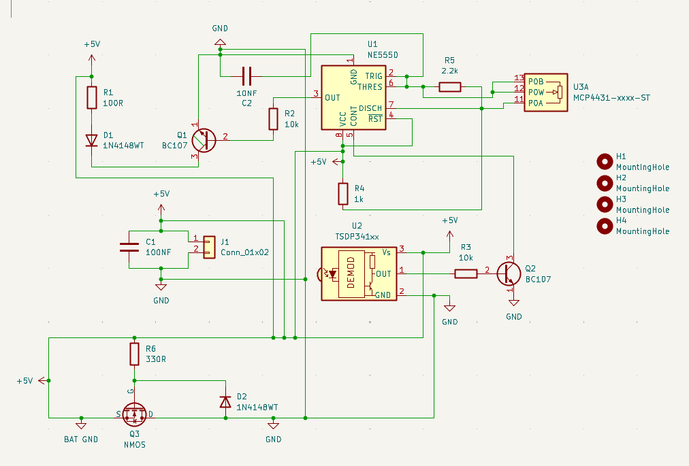
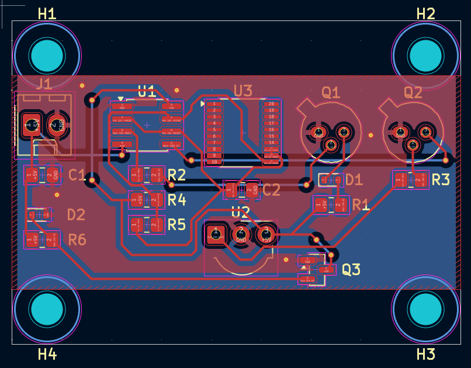

## March 5, 2026
**Objective:**  
Evaluate non-MCU repeater.

**Work Done:**  
- Analyzed 555 timer-based repeater.

**Findings:**  
- Pros: simpler, cheaper  
- Cons: no signal validation, amplifies noise  

**Conclusion:**  
- Rejected in favor of MCU-based design.

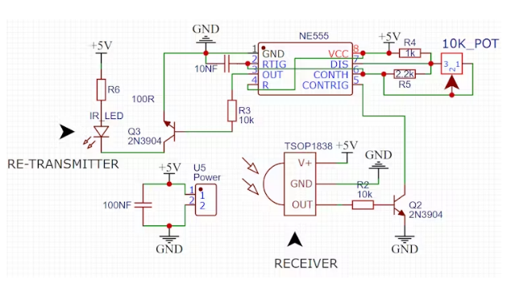
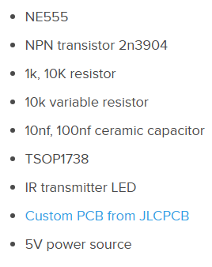
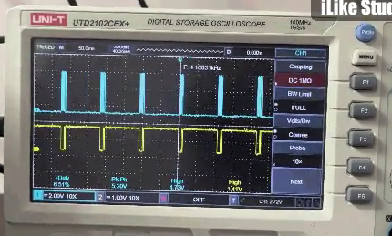

## March 27, 2026
**Objective:**  
Hardware prototyping and soldering.

**Work Done:**  
- Built IR transmitter and receiver circuits.  
- Practiced soldering components.

**Observations:**  
- Clean connections are critical for signal integrity.  
- Hardware debugging requires detailed notes.

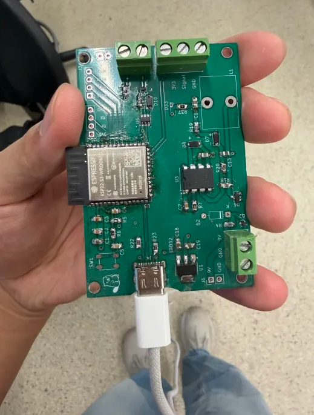

## April 10, 2026
**Objective:**  
Hardware prototyping and soldering.

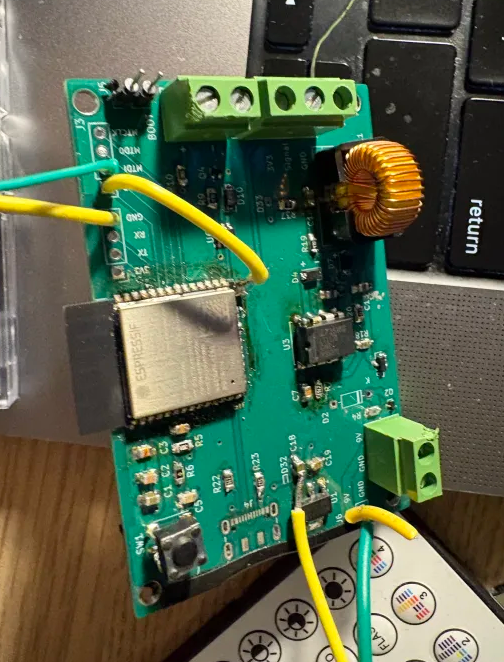
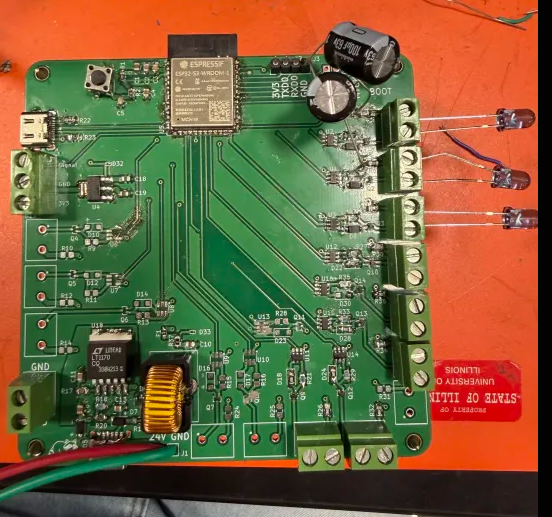

## April 16, 2026
**Objective:**  
Web application development.

**Work Done:**  
- Built UI for:
  - Presets  
  - Device control  
- Connected frontend to backend.

**Features:**  
- Remote IR control  

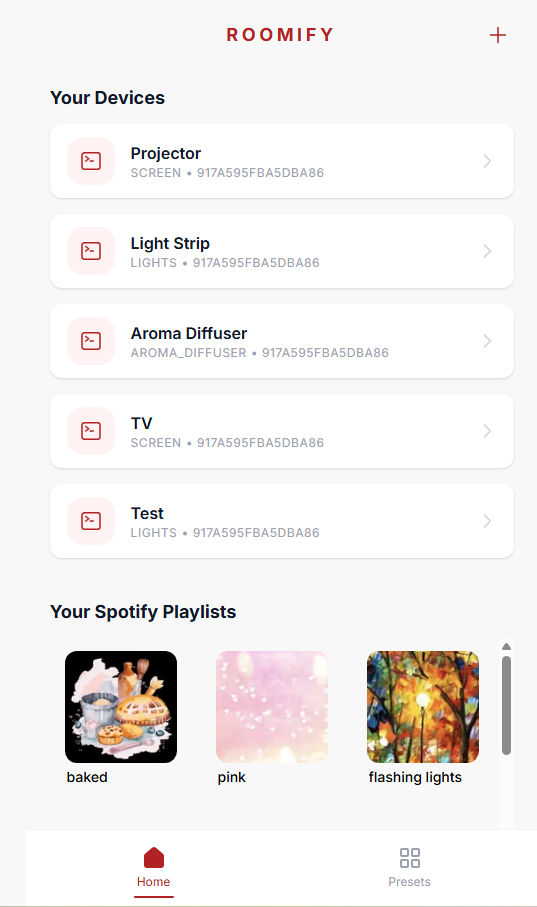
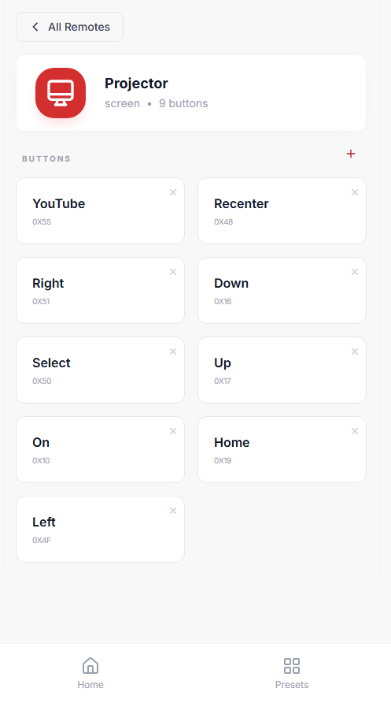

## April 25, 2026
**Objective:**  
Web application development.

**Work Done:**  
- Built UI for:
  - Presets  

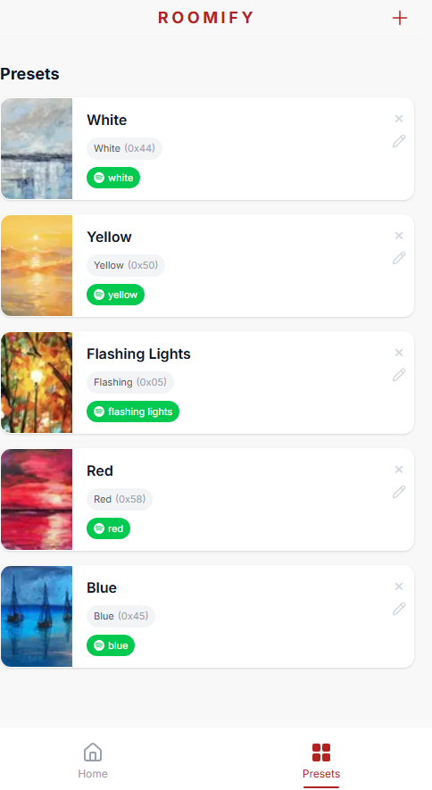
